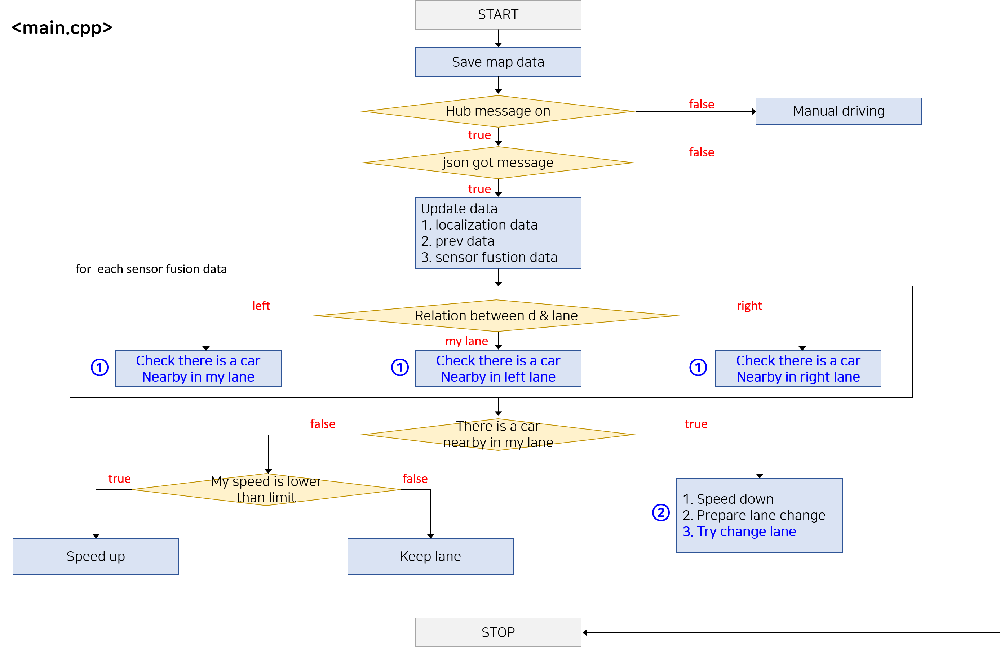

# SELF_DRIVING_CAR_ENGINEER_NANODEGREE-project7.-Highway-Driving


# Introduction

## 1. Purpose

Purpose of this project is to drive in highway without any collision or jerk

To do this project, I learned A* algorithm, Naive Bayes for prediction, FSM for behavior planning, trajectory generation


## 2. Rubric points

1. Should drive at least 4.32 miles

2. Should obey speed limit

3. Max acceleration and jerk should not exceed

4. Car should not have collisions

5. The car should stay in its lane, except for the time between changing lanes.

6. The car is able to change lanes

## 3. Input data given by simulator / Output data for simulator

1. Input

- Map data for .csv ( x, y, s, dx, dy )
- Localization data ( x, y, s, d, yaw, speed )
- Previous path data ( remaining path map data )
- Sensor fusion data ( id, x, y, vx, vy, s, d ) 

2. Ouput
- Next position calulated by my algorithm ( x, y ) 

## 4. My intention of algorithm

My intention for algorithm is very simple

Just make beginner driver!

This is some principles my beginner driver should obey

1. Obey speed limit

2. Keep lane until a car showed up in front

3. Change lane when front is blocked

4. If want change lane, there should be no car near 10m in intended lane behind

5. If want change lane, select lane that have bigger space between front car

And this is Finite State Machine for this principles


# Background Learning

For this project, I had to learn principle of Particle-Filter

### 1. Motion models

- Assumption for bicycle model


# Content Of This Repo
- ```src``` a directory with the project code
	- ```main.cpp``` : communicate with simulator, reads in data, calls a function in helpers.h to drive
	- ```helpers.h``` : have functions have to be used in main.cpp


# Flow

## 1. Flow Chart




# Results


# Conclusion & Discussion

### 1. About total flow of self-driving car

What do we need to make self driving car?


