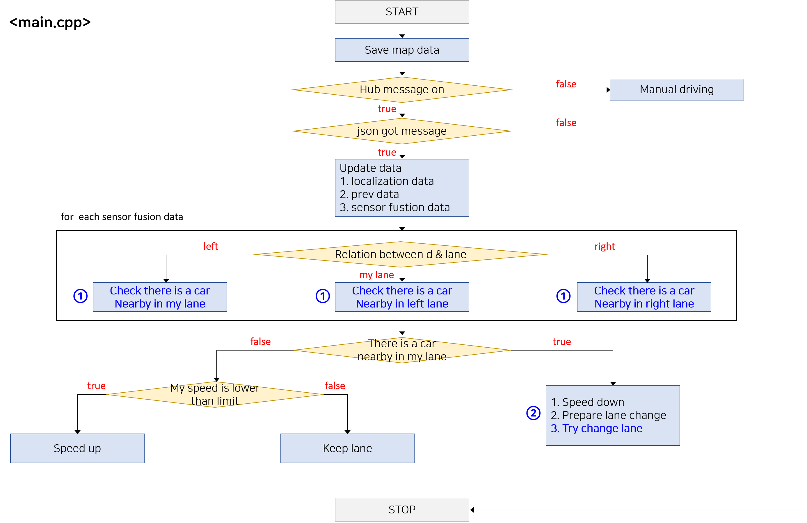

# SELF DRIVING CAR NANODEGREE
# project7. Highway Driving

## 1. Abstraction

The purpose of this project is to drive in highway without any collision or jerk

To do that, I studied A* algorithm, Naive Bayes for prediction, FSM for behavior planning, trajectory generation

The rubric points of this project is like below

- Should drive at least 4.32 miles
- Should obey speed limit
- Max acceleration and jerk should not exceed
- Car should not have collisions
- The car should stay in its lane, except for the time between changing lanes.
- The car is able to change lanes

And I receive 4 kinds of input data from simulator

- Map data for .csv ( x, y, s, dx, dy )
- Localization data ( x, y, s, d, yaw, speed )
- Previous path data ( remaining path map data )
- Sensor fusion data ( id, x, y, vx, vy, s, d ) 

Then I have to make next position (x,y) as output

My intention for algorithm is very simple

Just make beginner driver!

This is some principles my beginner driver should obey

- Obey speed limit
- Keep lane until a car showed up in front
- Change lane when front is blocked
- If want change lane, there should be no car near 10m in intended lane behind
- If want change lane, select lane that have bigger space between front car

And this is Finite State Machine explaining all this principles


## 2. Related Study

#### 1) Total Subject Flow

This project is collection of Self Driving Car projects

Every concept I learned until now is represented in this project

Sensor fusion is used to detect any objects using radar/ridar

Localization is used to find my exact position

Search is used to find optimal path to destination

Prediction is used to predict next behavior of sensored objects

Behavioral planning is used to planning my action against predicted object's behavior

Trajectory generation is finally used to make trajectory for my final action


#### 2) Search

For searching optimal path to destination, I learned A* & A* hibrid algorithm

A* hibrid algorithm is equal to A* but is different at continuous moving


#### 3) Prediction

To drive manually, after getting map data and knowing where the other cars are, I will curious about what will they do

There are two approaches for prediction

First method is called Model-based approach, using mathmatics and physics

Second method is called Data-driven approach

It needs so many labeled data

Then by using Naive Bayes Classifier, we can predict next action of detected objects

#### 4) Behavior Planning

After Knowing what the other car do, I have to decide then, what will I do next?

To do that, I have to define Finite State Machine

That is method to define all the cases can happen in driving situation

In other words, if there happen the case I didn't define, there will be accident

So it will useful just like this highway simulation case


#### 5) Trajectory Generation

Making a trajectory after deciding action is just math

But have to careful about not to make jerk or rapid acceleration

Make polynimial path through point I decided


## 3. Details

#### 1) Content Of This Repo

- ```src``` a directory of the project code
	- ```main.cpp``` : communicate with simulator, reads in data, calls a function in helpers.h to drive
	- ```helpers.h``` : have functions have to be used in main.cpp

#### 2) Code

① main.cpp



```c++
#include <uWS/uWS.h>
#include <fstream>
#include <iostream>
#include <string>
#include <vector>
#include "Eigen-3.3/Eigen/Core"
#include "Eigen-3.3/Eigen/QR"
#include "helpers.h"
#include "json.hpp"
#include "spline.h"

using nlohmann::json;
using std::string;
using std::vector;

int main() {
  uWS::Hub h;

  vector<double> map_waypoints_x;
  vector<double> map_waypoints_y;
  vector<double> map_waypoints_s;
  vector<double> map_waypoints_dx;
  vector<double> map_waypoints_dy;

  string map_file_ = "../data/highway_map.csv";
  // The max s value before wrapping around the track back to 0
  double max_s = 6945.554;

  std::ifstream in_map_(map_file_.c_str(), std::ifstream::in);

  string line;
  while (getline(in_map_, line)) {
    std::istringstream iss(line);
    double x;
    double y;
    float s;
    float d_x;
    float d_y;
    iss >> x;
    iss >> y;
    iss >> s;
    iss >> d_x;
    iss >> d_y;
    map_waypoints_x.push_back(x);
    map_waypoints_y.push_back(y);
    map_waypoints_s.push_back(s);
    map_waypoints_dx.push_back(d_x);
    map_waypoints_dy.push_back(d_y);
  }
  
  int lane_number = 1;

  double car_velocity = 0.0;

  h.onMessage([&lane_number, &car_velocity, &map_waypoints_x,&map_waypoints_y,&map_waypoints_s,
               &map_waypoints_dx,&map_waypoints_dy]
              (uWS::WebSocket<uWS::SERVER> ws, char *data, size_t length,
               uWS::OpCode opCode) {

    if (length && length > 2 && data[0] == '4' && data[1] == '2') {

      auto s = hasData(data);

      if (s != "") {
        auto j = json::parse(s);
        
        string event = j[0].get<string>();
        
        if (event == "telemetry") {

          double car_x = j[1]["x"];
          double car_y = j[1]["y"];
          double car_s = j[1]["s"];
          double car_d = j[1]["d"];
          double car_yaw = j[1]["yaw"];
          double car_speed = j[1]["speed"];

          auto previous_path_x = j[1]["previous_path_x"];
          auto previous_path_y = j[1]["previous_path_y"];

          double end_path_s = j[1]["end_path_s"];
          double end_path_d = j[1]["end_path_d"];

          auto sensor_fusion = j[1]["sensor_fusion"];

          json msgJson;
          
          int prev_size = previous_path_x.size();
          
          if (prev_size > 0)
          {
            car_s = end_path_s;            
          }
          
          bool too_close_my_lane = false;
          bool too_close_left_lane = false;
          bool too_close_right_lane = false;
          
          closest_distance_front_car_my_lane = max_cost_front;
          closest_distance_back_car_my_lane = max_cost_back;
          
          closest_distance_front_car_left_lane = max_cost_front;
          closest_distance_back_car_left_lane = max_cost_back;
          
          closest_distance_front_car_right_lane = max_cost_front;
          closest_distance_back_car_right_lane = max_cost_back;
          
          for (auto &i : sensor_fusion)
          {
            float d = i[6];
            
            // 1. check same line
            if ((d < lane_number*4 + 4) && (d > lane_number*4))
            {
              too_close_my_lane = too_close_my_lane || check_too_close(i, car_s, prev_size, direction::my_lane);
            }
            
            // 2. check left line
            if ((lane_number != 0) && (d < lane_number*4) && (d > lane_number*4 - 4))
            {
              too_close_left_lane = too_close_left_lane || check_too_close(i, car_s, prev_size, direction::left_lane);
            }
            
            // 3. check right line
            if ((lane_number != 2) && (d < lane_number*4 + 8) && (d > lane_number*4 + 4))
            {
              too_close_right_lane = too_close_right_lane || check_too_close(i, car_s, prev_size, direction::right_lane);
            }
            
          }
          
          /*
          1. If there is not car nearby in front,
           1) If my velocity is slower than limit, speed up
           2) If my velocity is equal to limit, keep lane
          2. If there is car nearby in front,
           1) Slow down
           2) Prepare to chane lane
           3) Try lane change
          */
          
         if (!too_close_my_lane)
         {
           if ( car_velocity < 49.0)
           {
             car_velocity += 0.5; 
           }
           else
           {
             change_FSM_state(FSM_state::keep_lane);
           }
         }
         else
         {
           car_velocity -= 0.5;
           change_FSM_state(FSM_state::prepare_lane_change);
           try_lane_change(lane_number, car_d, too_close_left_lane, too_close_right_lane);
         }
         
          // Under this line, it is process of gerating path
          // Widely spaced points in 30m apart then fit spline and fill the points to get ref v
          vector<double> pts_x;
          vector<double> pts_y;

          double ref_x = car_x;
          double ref_y = car_y;
          double ref_angle = deg2rad(car_yaw);

          if(prev_size < 2)
          {
            double car_prev_x = car_x - cos(car_yaw);
            double car_prev_y = car_y - sin(car_yaw);

            pts_x.push_back(car_prev_x);
            pts_x.push_back(car_x);

            pts_y.push_back(car_prev_y);
            pts_y.push_back(car_y);
          }
          else
          {
            ref_x = previous_path_x[prev_size-1];
            ref_y = previous_path_y[prev_size-1];

            double ref_prev_x = previous_path_x[prev_size-2];
            double ref_prev_y = previous_path_y[prev_size-2];

            ref_angle = atan2(ref_y-ref_prev_y,ref_x-ref_prev_x);

            pts_x.push_back(ref_prev_x);
            pts_x.push_back(ref_x);

            pts_y.push_back(ref_prev_y);
            pts_y.push_back(ref_y);
          }
                
          vector<double> nextWP0 = getXY(car_s + 30, (2 + 4 * lane_number), map_waypoints_s, map_waypoints_x, map_waypoints_y);
          vector<double> nextWP1 = getXY(car_s + 60, (2 + 4 * lane_number), map_waypoints_s, map_waypoints_x, map_waypoints_y);
          vector<double> nextWP2 = getXY(car_s + 90, (2 + 4 * lane_number), map_waypoints_s, map_waypoints_x, map_waypoints_y);

          pts_x.push_back(nextWP0[0]);
          pts_x.push_back(nextWP1[0]);
          pts_x.push_back(nextWP2[0]);

          pts_y.push_back(nextWP0[1]);
          pts_y.push_back(nextWP1[1]);
          pts_y.push_back(nextWP2[1]);

          for(int i = 0; i < pts_x.size() ; i++)
          {
            // Shift to Car ref angle of 0 degree
            double shift_x = pts_x[i] - ref_x;
            double shift_y = pts_y[i] - ref_y;

            pts_x[i] = (shift_x * cos(0-ref_angle) - shift_y * sin(0-ref_angle));
            pts_y[i] = (shift_x * sin(0-ref_angle) + shift_y * cos(0-ref_angle));
          }

          tk::spline s;

          s.set_points(pts_x,pts_y);
          
          vector<double> next_x_vals;
          vector<double> next_y_vals;


          for(int i = 0; i < prev_size; i++)
          {
            next_x_vals.push_back(previous_path_x[i]);
            next_y_vals.push_back(previous_path_y[i]);
          }

          double target_x = 30.0;
          double target_y = s(target_x);

          double target_dist = sqrt((target_x * target_x) + (target_y * target_y));
          double x_add_on = 0;

          double dist_inc = 0.44;
          for(int i = 1; i < 50-prev_size; i++)
          {
            // N steps req for desired speed = distance/distance/sec ; 2.24 - makes miles per hour to meters per sec
            double N = (target_dist/(0.02 * car_velocity/2.24));

            double x_point = x_add_on + (target_x/N);
            double y_point = s(x_point);

            x_add_on = x_point;

            double x_point_backup = x_point;
            double y_point_backup = y_point;

            // Rotate back to global coordinates
            x_point = (x_point_backup * cos(ref_angle) - y_point_backup * sin(ref_angle));
            y_point = (x_point_backup * sin(ref_angle) + y_point_backup * cos(ref_angle));

            x_point += ref_x;
            y_point += ref_y;

            next_x_vals.push_back(x_point);
            next_y_vals.push_back(y_point);
          }

          msgJson["next_x"] = next_x_vals;
          msgJson["next_y"] = next_y_vals;

          auto msg = "42[\"control\","+ msgJson.dump()+"]";

          ws.send(msg.data(), msg.length(), uWS::OpCode::TEXT);
        }  // end "telemetry" if
      } else {
        // Manual driving
        std::string msg = "42[\"manual\",{}]";
        ws.send(msg.data(), msg.length(), uWS::OpCode::TEXT);
      }
    }  // end websocket if
  }); // end h.onMessage

  h.onConnection([&h](uWS::WebSocket<uWS::SERVER> ws, uWS::HttpRequest req) {
    std::cout << "Connected!!!" << std::endl;
  });

  h.onDisconnection([&h](uWS::WebSocket<uWS::SERVER> ws, int code,
                         char *message, size_t length) {
    ws.close();
    std::cout << "Disconnected" << std::endl;
  });

  int port = 4567;
  if (h.listen(port)) {
    std::cout << "Listening to port " << port << std::endl;
  } else {
    std::cerr << "Failed to listen to port" << std::endl;
    return -1;
  }
  
  h.run();
}
```

② check_too_close function


```c++
bool check_too_close(vector<double> sensor_fusion, double car_s, int prev_size, direction dir)
{
  double vx = sensor_fusion[3];
  double vy = sensor_fusion[4];
  double predicted_next_s = sensor_fusion[5];
  double sensored_velocity = sqrt(vx*vx + vy*vy);
  
  predicted_next_s += (double) prev_size * sensored_velocity * 0.02;
  
  double front_car_distance = max_cost_front;
  double back_car_distance = max_cost_back;
  
  retrieve_distances(dir, front_car_distance, back_car_distance);
  
  bool result = false;
  
  if (predicted_next_s > car_s)
  {
    front_car_distance = predicted_next_s - car_s;
    if (front_car_distance < 30)
    {
      result = true;
    }
  }
  else
  {
    back_car_distance = car_s - predicted_next_s;
    if (dir == direction::my_lane)
    {
      result = false;
    }
    else
    {
      if (back_car_distance <= 10)
      {
        result = true;
      }
    }
  }
  update_closest_distance(dir, front_car_distance, back_car_distance);
  return result;
  
}
```

③ try_lane_change


```c++
void try_lane_change (int &lane_number, double car_d, bool too_close_left_lane, bool too_close_right_lane)
{
  double left_change_cost = lane_chage_cost(lane_number, direction::left_lane);
  double right_change_cost = lane_chage_cost(lane_number, direction::right_lane);
  
  // 1. If left cost is lower than right. and it has no car nearby, go to left
  if (( left_change_cost < right_change_cost) && (!too_close_left_lane))
  {
    lane_number--;
    change_FSM_state(FSM_state::change_to_left_lane);
  }
  // 2. If right cost is lower than left, and it has no car nearby, go to right
  else if (( left_change_cost > right_change_cost) && (!too_close_right_lane))
  {
    lane_number++;
    change_FSM_state(FSM_state::change_to_right_lane);
  }
  // If both lanes are empty, select left lane
  else if ((left_change_cost == 0) && (right_change_cost == 0) && (!too_close_left_lane))
  {
    lane_number--;
    change_FSM_state(FSM_state::change_to_left_lane);
  } 
  else
  {
    std::cout<<"!!!!!!!!!!!!!!! Lane Change is Not Safe !!!!!!!!!!!!!!!!!!"<<std::endl;
  }
  
  std::cout<< "Left Change Cost : "<<left_change_cost<< endl;
  std::cout<< "Right Change Cost : "<<right_change_cost<< endl;
  std::cout<< "Too Close Left Lane : "<<too_close_left_lane<< endl;
  std::cout<< "Too Close Right Lane : "<<too_close_right_lane<< endl;
}
```

④ lane_change_cost


```c++
double lane_chage_cost (int lane, direction wanna_direction)
{
  double cost = 100;
  
  // 1. If my car is in the first lane
  if (lane == 0)
  {
    // we cannot go more left
    if (wanna_direction == direction::left_lane)
    {
      cost = 100;
    }
    // calculate cost by diffrence between max distance, min distance
    else if (wanna_direction == direction::right_lane)
    {
      cost = (max_cost_front - closest_distance_front_car_right_lane);
    }
  }
  
  // 2. If my car is in the second lane
  else if (lane == 1)
  {
    // calculate cost by diffrence between max distance, min distance
    if (wanna_direction == direction::left_lane)
    {
      cost = (max_cost_front - closest_distance_front_car_left_lane);
    }
    // calculate cost by diffrence between max distance, min distance
    else if (wanna_direction == direction::right_lane)
    {
      cost = (max_cost_front - closest_distance_front_car_right_lane);
    }
  }
  
  // 3. If my car is in the second lane
  else if (lane == 2)
  {
    // calculate cost by diffrence between max distance, min distance
    if (wanna_direction == direction::left_lane)
    {
      cost = (max_cost_front - closest_distance_front_car_left_lane);
    }
    // we cannot go more right
    else if (wanna_direction == direction::right_lane)
    {
      cost = 100;
    }
  }
  
  return cost;
  
}
```


## 4. Results

It drove well without ant jerks or collides


## 5. Discussion

#### 1) About limitation

In this project, I did not use search and prediction

Maybe it can be apart from the intention of project

My algorithm is just check there is car nearby and make trajectory to change my lane

It can be useful because this project is just driving in simple highway

I didn't have to calculate optimal path to destination,

I didn't have to predict opponent car's behavior at intersection

So I am very looking forward to final project, driving autonomously at real city

